# Hi, I'm Karim

I'm currently working on my dissertation in venture capital, where I am exploring whether co-investment networks can help predict startup success and outcomes. I enjoy working on questions that sit[...]

I'm also building my Python skills and looking to collaborate on research in venture capital and private equity. My background includes venture capital, private equity, financial modeling, and anal[...]

Outside of academics, I care about impact and leadership. I have worked on initiatives like Campaign52 in East Africa, and I enjoy staying active through jiu jitsu, calisthenics, and piano.

You can find me on [LinkedIn](https://www.linkedin.com/in/karim-abbas-ab1bb0252/) or reach me at [karimabbas422@gmail.com](mailto:karimabbas422@gmail.com).
Fun fact: I have lived in all the countries with United in the name.

---

## My Journey So Far

This repository maps my academic and professional journey across the **University of Leeds**, **UCL**, and independent ventures — and shows how the different threads of my work connect.

**[Read the full journey →](./JOURNEY.md)**

A chronological walkthrough from my BSc in Banking & Finance at Leeds (dissertation on PE impact in US pharma, Standard Chartered internship in Dubai), through my MSc in Private Equity, Venture Ca[...]

---

## How My Work Connects

The diagram below shows how skills, themes, and domains intersect across my portfolio. Each project sits at the crossroads of multiple disciplines — nothing exists in isolation.

```mermaid
graph TD

    %% ════════════════════════════════════════
    %% INSTITUTION GROUPS
    %% ════════════════════════════════════════

    subgraph LEEDS ["University of Leeds"]
        direction LR
        DISS([Dissertation:\nPE in US Pharma])
        SCB([Standard Chartered\nTreasury Markets])
    end

    subgraph UCL_GROUP ["UCL — MSc PE, VC & Fintech"]
        direction LR
        BB([Balfour Beatty\nEquity Research])
        SIGMA([SigmaData\nInvestment Case])
        FINVISE([Finvise\nInvestment Case])
        RCM([RCM US:\nTiger Global])
        BICO([Biconomy\nWhite Paper])
        SHIP([Shipping\nML Forecasting])
        SILK([Silk Road\nVentures Fund])
    end

    subgraph OUTSIDE ["Outside — Independent & Professional"]
        direction LR
        DUNES([Duneway Ventures\nMENA Fund])
        KHAZNA([Khazna\nInvestment Case])
        VENSURE([Vensure\nCapital])
        WANDR([Wandr\nStartup])
    end

    %% ════════════════════════════════════════
    %% SKILL / THEME NODES (centre column)
    %% ════════════════════════════════════════

    FA{{"Financial Analysis\n& Valuation"}}
    FT{{"Fintech &\nInnovation"}}
    VCD{{"Venture Capital\n& Fund Design"}}
    DS{{"Data Science &\nQuantitative Methods"}}
    EM{{"MENA &\nEmerging Markets"}}
    SB{{"Startup\nBuilding"}}

    %% ════════════════════════════════════════
    %% CONNECTIONS: Leeds → Themes
    %% ════════════════════════════════════════

    DISS --- FA
    DISS --- DS
    SCB --- EM

    %% ════════════════════════════════════════
    %% CONNECTIONS: UCL → Themes
    %% ════════════════════════════════════════

    BB --- FA
    SIGMA --- FA
    SIGMA --- VCD
    SIGMA --- DS
    FINVISE --- FA
    FINVISE --- FT
    FINVISE --- VCD
    RCM --- FA
    RCM --- FT
    RCM --- VCD
    BICO --- FT
    SHIP --- DS
    SILK --- VCD

    %% ════════════════════════════════════════
    %% CONNECTIONS: Outside → Themes
    %% ════════════════════════════════════════

    DUNES --- VCD
    DUNES --- EM
    KHAZNA --- FA
    KHAZNA --- FT
    KHAZNA --- EM
    VENSURE --- VCD
    VENSURE --- FT
    VENSURE --- EM
    WANDR --- FT
    WANDR --- SB

    %% ════════════════════════════════════════
    %% STYLES
    %% ════════════════════════════════════════

    classDef theme fill:#1a1a2e,stroke:#e94560,stroke-width:2px,color:#fff,font-weight:bold;
    classDef leedsStyle fill:#fce4ec,stroke:#c62828,stroke-width:1.5px,color:#333;
    classDef uclStyle fill:#e3f2fd,stroke:#1565c0,stroke-width:1.5px,color:#333;
    classDef outsideStyle fill:#e8f5e9,stroke:#2e7d32,stroke-width:1.5px,color:#333;

    class FA,FT,VCD,DS,EM,SB theme;
    class DISS,SCB leedsStyle;
    class BB,SIGMA,FINVISE,RCM,BICO,SHIP,SILK uclStyle;
    class DUNES,KHAZNA,VENSURE,WANDR outsideStyle;

    style LEEDS fill:#fff5f5,stroke:#c62828,stroke-width:2px,color:#333;
    style UCL_GROUP fill:#f0f7ff,stroke:#1565c0,stroke-width:2px,color:#333;
    style OUTSIDE fill:#f0fff0,stroke:#2e7d32,stroke-width:2px,color:#333;
```

**Legend**: Projects are grouped by institution. The dark theme nodes in the centre show the skills and domains that connect work across all three phases of my journey.

---

## Explore My Work

### Reports & Investment Cases
| Project | Context | Key Skills |
|---|---|---|
| [Dissertation: PE in US Pharma](./Portfolio%20of%20Work/Reports%20%26%20Investment%20Cases/Dissertation%20in%20US%20Pharam%20Private%20Equity%20Impact.pdf) | Leeds BSc | Econometrics, panel reg[...]
| [Balfour Beatty Research Note](./Portfolio%20of%20Work/Reports%20%26%20Investment%20Cases/BalfourBeatty%20Research%20Note.pdf) | UCL | Equity research, DCF valuation, financial modelling |
| [SigmaData Investment Case](./Portfolio%20of%20Work/Reports%20%26%20Investment%20Cases/Sigmadata%20Investment%20Case.pdf) | UCL | VC due diligence, SaaS metrics, AI/NLP evaluation |
| [Finvise Investment Case](./Portfolio%20of%20Work/Reports%20%26%20Investment%20Cases/Investment%20Case%20Finvise.pdf) | UCL | Early-stage valuation, term sheets, cap tables |
| [RCM US — Tiger Global](./Portfolio%20of%20Work/Reports%20%26%20Investment%20Cases/Investment%20Case%20RCM%20US.pdf) | UCL | Healthcare fintech, competitive benchmarking |
| [Khazna Investment Recommendation](./Portfolio%20of%20Work/Reports%20%26%20Investment%20Cases/Khazna%20Pitchdeck.pdf) | Independent | Emerging market fintech, financial inclusion |
| [Biconomy White Paper](./Portfolio%20of%20Work/Reports%20%26%20Investment%20Cases/Fintech%20Project%20copy.pdf) · [Presentation](./Portfolio%20of%20Work/Reports%20%26%20Investment%20Cases/Group%20D%20-%20Presentation%20copy.pdf) | UCL | Blockchain, DeFi, AI infrastructure |
| [Shipping ML Forecasting](./Portfolio%20of%20Work/Reports%20%26%20Investment%20Cases/Shipping%20Trends%20in%20EU%20Machien%20Learning%20Project%20.pdf) · [Code](https://github.com/karimabbas22/UK-EU-Container-Shipping-Volume-Analysis) | UCL — Data Analytics | Python, panel regression, time-series ML |

### VC Fund Pitchdecks
| Project | Context | Key Skills |
|---|---|---|
| [Silk Road Ventures](./Portfolio%20of%20Work/VC%20Pitchdecks/Silk%20Ventures%20Pitch%20Deck.pdf) · [GP Doc](./Portfolio%20of%20Work/VC%20Pitchdecks/GP%20Document%20for%20Hedge%20Funds%20Silk%2) [...]
| [Duneway Ventures](./Portfolio%20of%20Work/VC%20Pitchdecks/Dunes%20Ventures%20Pitch%20Deck.pdf) · [Investment Memo](./Portfolio%20of%20Work/VC%20Pitchdecks/Investment%20Thesis.pdf) | Stanford [...]
| [Vensure Capital](./Portfolio%20of%20Work/VC%20Pitchdecks/Vensure%20Capital.pdf) | UCL | Fund management, DeFi, portfolio strategy |

### Startup Pitchdecks
| Project | Context | Key Skills |
|---|---|---|
| [Wandr](./Portfolio%20of%20Work/Startup%20Pitchdecks/Wandr.pdf) | Stanford ASES | Product design, market sizing, go-to-market |

---

**Karim Abbas** — BSc Banking & Finance (University of Leeds) · MSc Private Equity, Venture Capital & Fintech (UCL)
