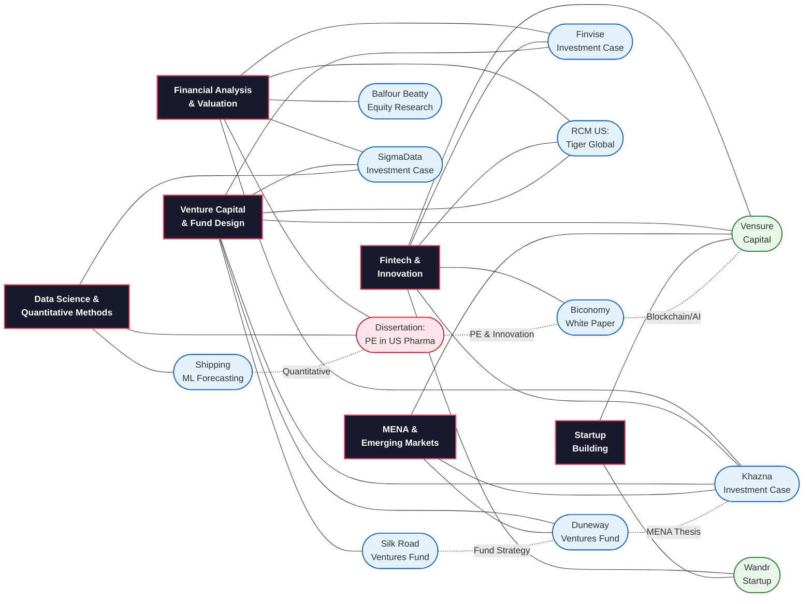

# Karim Abbas — My Journey So Far

Welcome to my portfolio. This repository maps my academic and professional journey across the **University of Leeds**, **UCL**, and independent ventures — and shows how the different threads of my work connect.

## The Journey

**[Read the full journey →](./JOURNEY.md)**

A chronological walkthrough from my BSc in Banking & Finance at Leeds (dissertation on PE impact in US pharma, Standard Chartered internship in Dubai), through my MSc in Private Equity, Venture Capital & Fintech at UCL (investment cases, VC fund design, fintech analysis, data science), and into independent ventures (Vensure Capital, Wandr).

---

## How My Work Connects

The diagram below shows how skills, themes, and domains intersect across my portfolio. Each project sits at the crossroads of multiple disciplines — nothing exists in isolation.

**Legend**: 🔴 Leeds · 🔵 UCL · 🟢 Outside/Independent

---

## Explore My Work

### Reports & Investment Cases
| Project | Context | Key Skills |
|---|---|---|
| [Dissertation: PE in US Pharma](./Portfolio%20of%20Work/Reports%20%26%20Investment%20Cases/Dissertation%20in%20US%20Pharam%20Private%20Equity%20Impact.pdf) | Leeds BSc | Econometrics, panel regressions, academic research |
| [Balfour Beatty Research Note](./Portfolio%20of%20Work/Reports%20%26%20Investment%20Cases/BalfourBeatty%20Research%20Note.pdf) | UCL — IFTE0015 | Equity research, DCF valuation, financial modelling |
| [SigmaData Investment Case](./Portfolio%20of%20Work/Reports%20%26%20Investment%20Cases/Sigmadata%20Investment%20Case.pdf) | UCL — IFTE0015 | VC due diligence, SaaS metrics, AI/NLP evaluation |
| [Finvise Investment Case](./Portfolio%20of%20Work/Reports%20%26%20Investment%20Cases/Investment%20Case%20Finvise.pdf) | UCL — IFTE0015 | Early-stage valuation, term sheets, cap tables |
| [RCM US — Tiger Global](./Portfolio%20of%20Work/Reports%20%26%20Investment%20Cases/Investment%20Case%20RCM%20US.pdf) | UCL — IFTE0015 | Healthcare fintech, competitive benchmarking |
| [Khazna Investment Recommendation](./Portfolio%20of%20Work/Reports%20%26%20Investment%20Cases/Khazna%20Pitchdeck.pdf) | UCL — IFTE0015 | Emerging market fintech, financial inclusion |
| [Biconomy White Paper](./Portfolio%20of%20Work/Reports%20%26%20Investment%20Cases/Fintech%20Project%20copy.pdf) · [Presentation](./Portfolio%20of%20Work/Reports%20%26%20Investment%20Cases/Group%20D%20-%20Presentation%20copy.pdf) | UCL — IFTE0014 | Blockchain, DeFi, AI infrastructure |
| [Shipping ML Forecasting](./Portfolio%20of%20Work/Reports%20%26%20Investment%20Cases/Shipping%20Trends%20in%20EU%20Machien%20Learning%20Project%20.pdf) · [Code](./Portfolio%20of%20Work/Reports%20%26%20Investment%20Cases/Shipping%20Project%20Code.pdf) | UCL — Data Analytics | Python, panel regression, time-series ML |

### VC Fund Pitchdecks
| Project | Context | Key Skills |
|---|---|---|
| [Silk Road Ventures](./Portfolio%20of%20Work/VC%20Pitchdecks/Silk%20Ventures%20Pitch%20Deck.pdf) · [GP Doc](./Portfolio%20of%20Work/VC%20Pitchdecks/GP%20Document%20for%20Hedge%20Funds%20Silk%20Road%20Ventures.pdf) · [LP Doc](./Portfolio%20of%20Work/VC%20Pitchdecks/LP%20Document%20Silk%20Ventures.pdf) | UCL — VC Fund Design | Fund structuring (LP/GP), portfolio construction, governance |
| [Duneway Ventures](./Portfolio%20of%20Work/VC%20Pitchdecks/Dunes%20Ventures%20Pitch%20Deck.pdf) · [Investment Memo](./Portfolio%20of%20Work/VC%20Pitchdecks/Investment%20Thesis.pdf) | UCL — VC Fund Design | MENA thematic investing, investment memorandums |
| [Vensure Capital](./Portfolio%20of%20Work/VC%20Pitchdecks/Vensure%20Capital.pdf) | Independent | Fund management, DeFi, portfolio strategy |

### Startup Pitchdecks
| Project | Context | Key Skills |
|---|---|---|
| [Wandr](./Portfolio%20of%20Work/Startup%20Pitchdecks/Wandr.pdf) | Independent | Product design, market sizing, go-to-market |

---

## About Me

**Karim Abbas** — BSc Banking & Finance (University of Leeds) · MSc Private Equity, Venture Capital & Fintech (UCL)

My work sits at the intersection of finance, technology, and venture capital. I've built investment cases for institutional funds, designed VC funds targeting fintech infrastructure, written white papers on blockchain/AI systems, run quantitative research from pharma patents to shipping logistics, and built a startup tackling misinformation.

This repository is the map of how it all connects.
